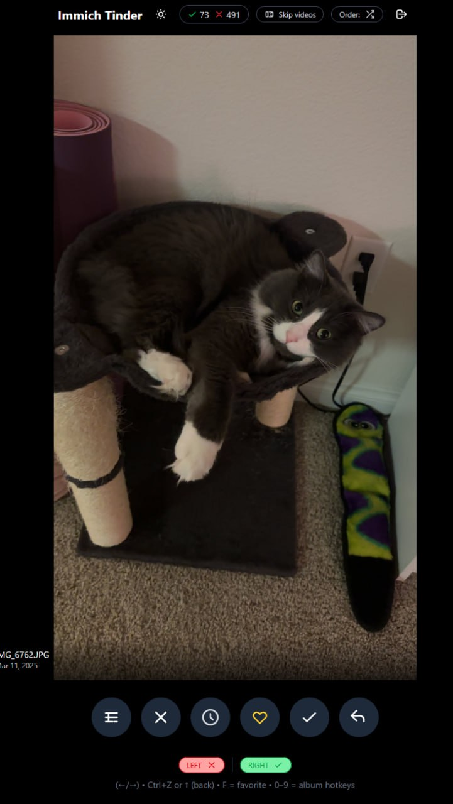
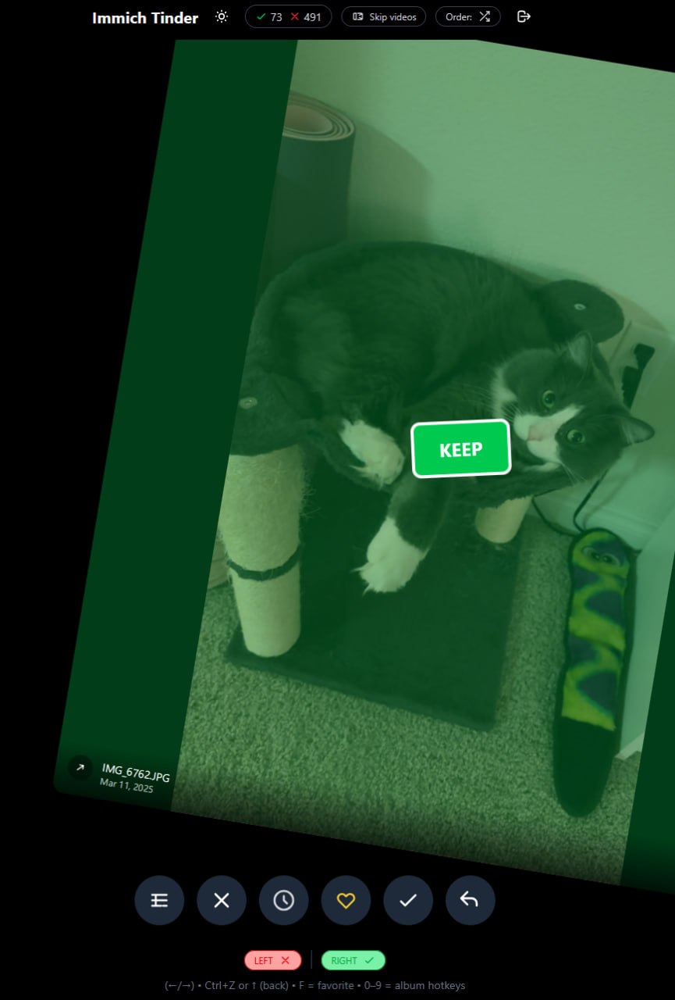
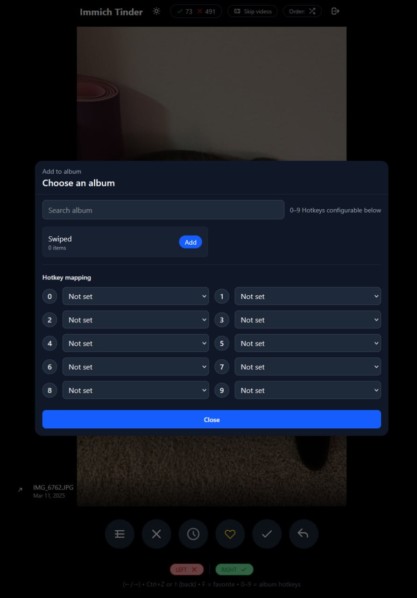
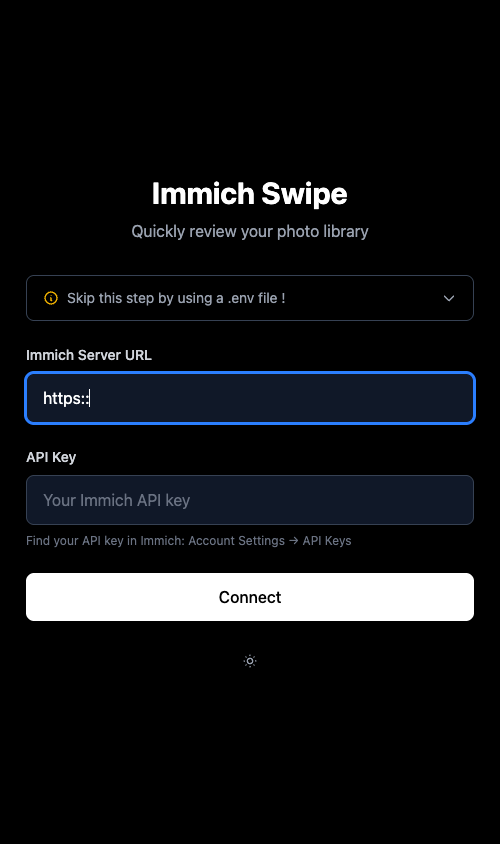

# Immich Tinder

> 🖥️ **Desktop app?** Download installers from [Releases](https://github.com/welldonestreams/immich-tinder/releases) — see [docs/DESKTOP.md](app/docs/DESKTOP.md).

### 🪟 Windows (easiest — no install, runs in your browser)

1. Download **[Immich.Tinder-windows-app.zip](https://github.com/welldonestreams/immich-tinder/releases/latest/download/Immich.Tinder-windows-app.zip)** from [Releases](https://github.com/welldonestreams/immich-tinder/releases)
2. **Extract** the zip, then double-click **`start.cmd`**
3. A setup wizard opens in your browser — enter your **Immich server URL** + **API key** (links tell you exactly where to find both)
4. Done — the app opens. The zip's `start.cmd` is the desktop shortcut (pin it to your taskbar)

> A native desktop installer (`.exe`) is also available in [Releases](https://github.com/welldonestreams/immich-tinder/releases) if you prefer that instead.


Swipe-review your Immich library: right = keep, left = trash. Like a dating app, but for photos (and videos).


<p align="center">
  
</p>

<p align="center">
  
</p>

<p align="center">
  
</p>

## Features

- Swipe (touch/mouse) or use keyboard/buttons
- Random or chronological review (oldest/newest first)
- Skip videos toggle
- Favorite toggle (press `F`)
- Add-to-album (+ configurable `0–9` hotkeys)
- Undo (Ctrl/⌘+Z or ↑)
- Reviewed cache + stats persisted per server/user
- Preloads the next asset

## Controls

| Action | Gesture / Key | Button |
|---|---|---|
| Keep | Swipe right / `→` | ✓ |
| Delete (moves to trash) | Swipe left / `←` | ✕ |
| Undo | `Ctrl/⌘+Z` or `↑` | ↶ |
| Favorite | `F` | ♡ |
| Add to album | `0–9` (configured) | Album icon |

## Quickstart

### Local development

```bash
npm install
npm run dev
```

Open `http://localhost:5173`.

### Docker

```bash
cp env.example .env
# edit .env
cd app && docker compose up --build
```

Open `http://localhost:2293`.

Note: `.env` values are passed as build args and end up in the frontend bundle. Changing `.env` requires a rebuild.

### GitHub Pages

This repo includes a GitHub Actions workflow that builds and deploys the SPA to GitHub Pages on every push to `main`.

After enabling Pages in your repo settings, your URL will be:
- `https://<owner>.github.io/<repo>/`

<details>
  <summary>Login screen</summary>
  <p align="center">
    
  </p>
</details>

## Configuration

### Option A: `.env` users (build-time)

See `env.example`.

```bash
VITE_SERVER_URL=https://immich.example.com
VITE_USER_1_NAME=User 1
VITE_USER_1_API_KEY=your-api-key
```

Tip: `VITE_SERVER_URL` can be the base URL (recommended) or end with `/api` — the app normalizes it.

Behavior:
- 1 user configured: auto-login
- >1 users configured: user selection screen (`/select-user`)
- no `.env` users: manual login (`/login`), stored in `localStorage`

Note: user slots are currently wired up to `VITE_USER_5_*` in `src/vite-env.d.ts`, `Dockerfile`, and `docker-compose.yml`.

Security note: `VITE_*` variables are embedded into the compiled frontend. Only use `VITE_USER_*_API_KEY` for private deployments/images.

### Option B: manual login (runtime)

If you don’t configure `.env` users, the app asks for:
- Immich Server URL
- API key

Those values are stored in `localStorage` under `immich-swipe-config`.

## API / CORS / Proxy

All requests use Immich’s API (`/api/...`) with the `x-api-key` header, so your Immich instance (or reverse proxy in front of it) needs to allow CORS.

If `VITE_SERVER_URL` points directly to your Immich instance (for example `https://immich.example.com`), your browser calls `https://immich.example.com/api/...`.

You’ll need CORS headers. For Nginx Proxy Manager, add:

```nginx
add_header 'Access-Control-Allow-Origin' '*' always;
add_header 'Access-Control-Allow-Methods' 'GET, POST, PUT, PATCH, DELETE, OPTIONS' always;
add_header 'Access-Control-Allow-Headers' 'X-Api-Key, X-Target-Host, User-Agent, Content-Type, Authorization, Range, Accept' always;
add_header 'Access-Control-Expose-Headers' 'Content-Length, Content-Range, Accept-Ranges' always;
if ($request_method = OPTIONS) { return 204; }
```

See also: https://docs.immich.app/administration/reverse-proxy/

## Stored data (localStorage)

- `immich-swipe-config` (manual login: server URL + API key)
- `immich-swipe-theme`
- `immich-swipe-skip-videos`
- `immich-swipe-stats:<server>:<user>` (keep/delete counters)
- `immich-swipe-reviewed:<server>:<user>` (already reviewed IDs + decision)
- `immich-swipe-preferences:<server>:<user>` (order mode + album hotkeys)

## Immich API key permissions

Minimum:
- `asset.read`
- `asset.delete`

If you want albums and favorites, grant the corresponding read/update permissions as well.

## Development scripts

- `npm run dev` (Vite, `5173`, `--host`)
- `npm run build`
- `npm run preview`
- `npm run type-check`
- `npm test`

---

## Credits

Original creator: **[@dev-nick421](https://github.com/dev-nick421/immich-swipe)**.

Certain parts of the original were no longer working on current Immich servers — the app called API endpoints that **Immich v3 removed** (e.g. the random-photo endpoint), so it couldn't load photos at all. This fork fixes that and adds the **desktop app** for ease of setup and use.
